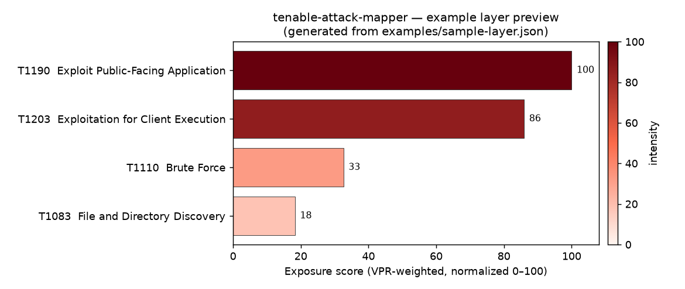

# Tenable ATT&CK Mapper

Map your **Tenable Security Center** vulnerability findings to **MITRE ATT&CK**
techniques and export a **VPR-scored ATT&CK Navigator layer** — so you can see
exactly which adversary techniques your exposure enables, ranked by risk, and
overlay them against your detection coverage to find exploitable-but-undetected
gaps.

It works two ways:

- **Headless** — a CLI / MCP server you run yourself.
- **Conversational** — a Claude Code agent you can just *ask*: "Which techniques
  should I watch for initial access?" → "Which of my findings match those?"

---

## What it does

- Pulls open findings from Security Center (plugin name, description, CVE, VPR).
- Maps each finding to ATT&CK techniques using a **deterministic chain**
  (CVE → CWE → CAPEC → ATT&CK) as the primary, authoritative evidence.
- Falls back to a **semantic** (Claude) mapping only where that chain is
  incomplete — and attaches a `confidence` and `reason_code` to **every** mapping
  so you can audit each link.
- Scores techniques by aggregated VPR and finding count, flagging low-confidence
  mappings as `needs-review` instead of silently trusting them.
- Exports a ready-to-import **ATT&CK Navigator layer (v4.5)** plus a Markdown
  coverage summary. The layer JSON *is* the UI — no web app to host.

---

## Use it in 3 steps

Even if you've never touched the code, this is all you need.

### 1. Install

```bash
# from a clone of this repo
pip install .

# with the conversational MCP server too
pip install ".[mcp]"
```

> Needs Python 3.12+. Prefer isolation? `pipx install .` or `uvx --from . tenable-attack-mapper --help`.

### 2. Configure

Copy the example env file and fill in your Security Center URL + API keys:

```bash
cp .env.example .env
```

```ini
TASC_SC_URL=https://localhost:8443/
TASC_SC_ACCESS_KEY=your-access-key
TASC_SC_SECRET_KEY=your-secret-key
# Optional — enables the semantic fallback for findings with no CVE chain:
ANTHROPIC_API_KEY=sk-ant-...
```

Generate the access/secret keys in Security Center under **User → API Keys**.
Secrets only ever live in `.env` (git-ignored) — they are never hard-coded.

### 3. Use

```bash
# Map repository 1 and write an importable Navigator layer
tenable-attack-mapper run --repo 1 --out layer.json --report coverage.md
```

Then open it in the [ATT&CK Navigator](https://mitre-attack.github.io/attack-navigator/):
**Open Existing Layer → Upload from local → pick `layer.json`**. Each mapped
technique is colored by its VPR-weighted exposure score.



> Full walkthrough — opening, self-hosting for sensitive data, reading the
> matrix, and overlaying against detection coverage — in
> **[docs/navigator.md](docs/navigator.md)**.

Other handy commands:

```bash
# Deterministic chain only (no Claude)
tenable-attack-mapper run --repo 1 --out layer.json --no-semantic

# Which of my findings map to specific techniques?
tenable-attack-mapper techniques T1190 T1059 --repo 1
```

---

## Conversational mode (Claude Code agent)

This repo is also a Claude Code plugin. The `attack-mapper` agent (see
`agents/attack-mapper.md`) talks to the MCP server in `mcp/server.py`, wired
together by `.claude-plugin/plugin.json`. Once installed you can ask:

> "For initial access, which ATT&CK techniques should I look at — and which of my
> findings match them?"

The agent calls `techniques_for_tactic`, then `my_findings_for_techniques`, and
summarizes by VPR.

---

## How it works

```
Security Center findings
        │
        ▼
┌───────────────────────────┐     ┌──────────────────────────────┐
│ Deterministic (primary)   │     │ Semantic fallback (Claude)    │
│ CVE → CWE → CAPEC → ATT&CK │     │ plugin name + description →   │
│ confidence ≈ 0.95         │     │ candidate techniques +        │
│ full evidence trail       │     │ confidence + reason_code      │
└───────────┬───────────────┘     └───────────────┬──────────────┘
            └───────────────┬───────────────────────┘
                            ▼
                  reconcile + de-duplicate
            (deterministic wins; flag < threshold)
                            ▼
              score by VPR × confidence × count
                            ▼
        Navigator layer (v4.5)  +  coverage report
```

The deterministic chain is authoritative; the semantic layer is a documented,
auditable fallback — never a silent guess. The two are reconciled, de-duplicated,
and VPR drives the per-technique intensity in the Navigator layer.

---

## Project layout

```
src/tenable_attack_mapper/
  sc_client.py        # pyTenable → open findings
  mapping/
    deterministic.py  # CVE→CWE→CAPEC→ATT&CK
    semantic.py       # Claude fallback (confidence + reason_code per mapping)
    reconcile.py      # merge, de-dup, score, flag needs-review
  navigator.py        # ATT&CK Navigator layer v4.5
  report.py           # coverage summary
  pipeline.py         # orchestration (the library entry point)
  cli.py              # `tenable-attack-mapper run ...`
  mcp/server.py       # FastMCP tools (same core functions)
data/                 # CVE/CWE/CAPEC/ATT&CK reference tables
agents/attack-mapper.md
.claude-plugin/plugin.json
examples/sample-layer.json
```

The core (`src/`) has no dependency on Claude Code — it runs standalone or under
any runtime.

---

## License

MIT — see [LICENSE](LICENSE).
