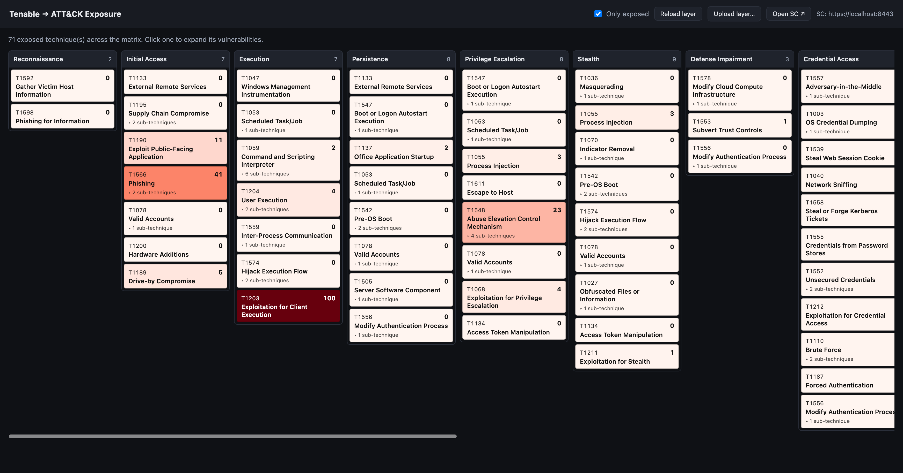

# Tenable ATT&CK Mapper

An **MCP server** that maps your **Tenable Security Center** findings to **MITRE
ATT&CK**, then lets you ask your LLM (Claude Code) — in plain language — to analyze
your exposure by any tactic or technique. Want the visual? Open a **VPR-scored ATT&CK
matrix** in your browser and click any technique to see the vulnerabilities behind it,
each linking to its detail page on your Security Center.



---

## Quickstart

### 1. Install uv

**uv** is a fast (Rust-based) Python package & virtualenv manager — ~8× quicker
than pip, and it manages the right Python version for you. One-time install:

```bash
curl -LsSf https://astral.sh/uv/install.sh | bash
```

Then open a **new terminal** so `uv` is on your PATH. On Windows, see the
[uv install docs](https://docs.astral.sh/uv/).

### 2. Install the tool

```bash
git clone https://github.com/ayuksel-tenb/tenable-attack-mapper
cd tenable-attack-mapper
uv venv && source .venv/bin/activate
uv pip install -e .
```

The virtualenv keeps deps isolated (no clashes with a base/conda Python).
Re-activate it (`source .venv/bin/activate`, or `.venv\Scripts\activate` on Windows)
in any new terminal.

> No uv? `python3 -m venv .venv && source .venv/bin/activate && pip install -e .`
> (Python 3.12+) works too — just slower.

### 3. Configure

```bash
cp .env.example .env
```

Set your Security Center URL and keys (`TSC_URL` / `TSC_ACCESS_KEY` / `TSC_SECRET_KEY`).
That's the only required config — semantic mapping runs through the local `claude`
CLI on your **Claude Code subscription** (no API key, no per-token cost), so just make
sure `claude` is on your PATH and logged in (`claude login`). Optional: tune
`TASC_CLAUDE_MODEL` (default `claude-haiku-4-5`) and `TASC_SEMANTIC_WORKERS`.

### 4. Connect it to Claude Code

Run this from the repo folder (step 2 already installed the server into `.venv`):

```bash
claude mcp add --transport stdio tenable-attack-mapper -- "$(pwd)/.venv/bin/tenable-attack-mapper-mcp"
```

No keys to repeat — the server reads the `.env` you set in step 3, even when Claude
Code launches it from another directory. Then `/mcp` should show it **connected**.

> Installed somewhere without the repo's `.env` (e.g. a global/uvx install)? Pass
> the keys explicitly instead: add `--env TSC_URL=… --env TSC_ACCESS_KEY=… --env
> TSC_SECRET_KEY=…` before `--transport`.

### 5. Use

Open Claude Code **in this folder** and ask — in order:

```
Open the attack matrix.
```
> **Do this first.** The first sync pulls your findings and maps them to ATT&CK —
> on a cold cache that's a few minutes (it maps ~1000 findings via the `claude`
> CLI). "Open the attack matrix" runs it as a **visible** step so you can watch
> progress, then opens the browser. After it finishes, the cache makes everything
> below instant.

```
Map my environment and show the top techniques by VPR.
Which of my findings map to T1190 and T1059?
```

`Open the attack matrix` brings up a local viewer and opens it in your browser —
techniques colored by VPR exposure; click one to see its vulnerabilities, each with
an ⓘ rationale and an **Open in SC** deep link.

---

## FAQ

**What does "Map my environment" actually do, and why does the first run take a few
minutes?**
It (1) connects to your Security Center and pulls open findings, (2) maps each to
ATT&CK deterministically (CVE → CWE → CAPEC/ATT&CK — fully local), and (3) for the
rest, asks Claude (via the local `claude` CLI) which techniques apply. The semantic
step runs `claude` over your CVE-bearing findings, batched and in parallel — for
~1000 findings that's a few minutes. Results are cached (`data/.semantic_cache.json`),
so re-runs are instant.
**Tip:** do the first (cold-cache) sync with **"Open the attack matrix"** or the CLI
(`uv run tenable-attack-mapper run --out layer.json`) so you can watch progress —
then `Map my environment` and other prompts return instantly from the cache. An MCP
tool call (like `Map my environment`) blocks with no progress bar, so on a cold cache
it can look hung for a few minutes when it's just mapping.

**After `claude mcp add`, why isn't it "connected" instantly — what is it waiting
for?**
Only for Claude Code to spawn the server and do a handshake — a few seconds to load
the Python package and register its 4 tools. It does **not** connect to Security
Center at connect time (that happens only when a tool runs). `/mcp` should show it
connected within a few seconds; if it lingers, the Python import is just warming up,
not waiting on your SC or network.

**What data leaves my machine? Do my IPs / ports / hostnames get sent anywhere?**
**No host-identifying data leaves your machine.** For the semantic step, the only
thing the local `claude` CLI sends to Anthropic is generic vulnerability info: the
**plugin ID, plugin name, CVE IDs, and the plugin description**
(truncated) — all of which is public, vendor-published data.
**Never sent:** IP addresses, ports, hostnames, MAC addresses, asset/host counts,
VPR scores, or your Security Center URL and API keys. The tool doesn't even *fetch*
host/IP/port fields from Security Center — it works per-plugin, not per-host.

**Is the deterministic mapping offline?**
Yes — fully local, no network calls, unless you opt into a live NVD CVE → CWE lookup
(`TASC_USE_NVD=true`), which sends only CVE IDs to NVD.

**Where do my findings and the ATT&CK layer live?**
Entirely on your machine. The layer JSON is written locally, the viewer runs in local
containers, and `layers/*.json` is git-ignored so exposure data is never committed.

**Which LLM does it use, and what does it cost?**
Semantic mapping shells out to the local **`claude` CLI** (default model
`claude-haiku-4-5`), billed to your **Claude Code subscription** — no API key and no
per-token cost. Calls are batched, run in parallel (`TASC_SEMANTIC_WORKERS`), and
cached per plugin, so a re-run over the same findings is free.

## Fresh start

`./uninstall.sh` blows away everything this tool runs in Docker — the
attack-navigator viewer/Navigator containers, their image, network and volumes,
plus any stray containers from earlier runs. It's scoped by name/image/compose
project, so unrelated containers (e.g. a Tenable SC lab box) are never touched.

---

**More:** [how mapping works](docs/mapping.md) · [CLI, OpenCode & tools](docs/usage.md) ·
[the viewer](https://github.com/ayuksel-tenb/attack-navigator) · MIT licensed.
